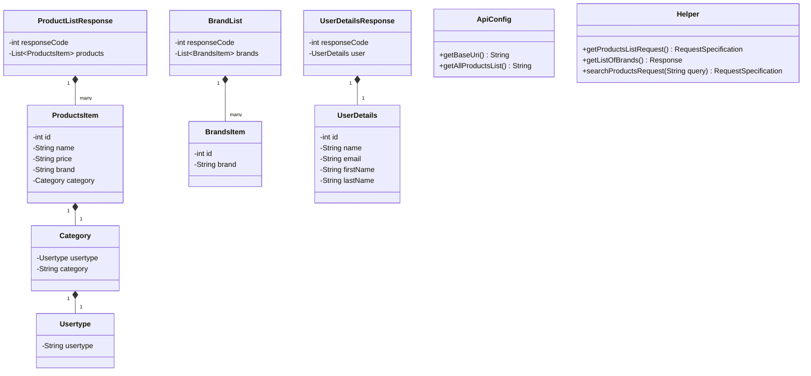

# 🚀 API Test Automation Framework

> A robust, clean, and highly maintainable test automation engine built to validate REST APIs on the **Automation Exercise** platform.

---

<p align="center">
  
  
  
  
  
</p>

---

## 📖 Table of Contents
1. [Key Features](#-key-features)
2. [Project Architecture](#-project-architecture)
3. [Test Suite Coverage](#-test-suite-coverage)
4. [Class Diagram](#-class-diagram)
5. [Getting Started](#-getting-started)
6. [CI/CD Pipeline](#-cicd-pipeline)
7. [Collaboration & Hand-over](#-collaboration--hand-over)
8. [Full Stack Analysis & Security Guidelines](#-full-stack-analysis--security-guidelines)
9. [Meet the Collaborators](#-meet-the-collaborators)

---

## ✨ Key Features

*   **POJO Response Mapping**: Uses Jackson `ObjectMapper` for precise serialisation and deserialisation of API responses.
*   **Centralised Request Specification Builder**: Unifies RestAssured settings (headers, credentials, query params) inside a utility class.
*   **Automated Content-Type Parsing**: Registers a custom global parser to handle standard HTML-based payloads safely.
*   **Comprehensive Coverage**: Validates user stories, happy/sad paths, custom HTTP statuses, and JSON schema boundaries.

---

## 🏗️ Project Architecture

```text
api_testing_project
 ├── PROJECT_BOARD.md                 # Scrum Board representation
 ├── pom.xml                          # Project build and dependencies configuration
 └── src/test
      ├── java
      │    └── com.sparta
      │         └── endpointtesting
      │              ├── pojoconfig                  # Team POJO mappings & tests
      │              │    ├── pojos
      │              │    │    ├── AccountResponse.java
      │              │    │    ├── BrandList.java
      │              │    │    ├── BrandsItem.java
      │              │    │    ├── Category.java
      │              │    │    ├── ProductListResponse.java
      │              │    │    ├── ProductsItem.java
      │              │    │    ├── UserDetails.java
      │              │    │    ├── UserDetailsResponse.java
      │              │    │    └── VerifyUserResponse.java
      │              │    └── UserDetailsIntegrationTest.java # User details schema & response checks
      │              ├── utils
      │              │    ├── ApiConfig.java          # Loads environment configuration
      │              │    └── Helper.java             # Shared request specifications helper
      │              ├── CreateAccountTest.java      # User Story 6 (POST create account checks)
      │              ├── DeleteAccountTest.java      # User Story 6 (DELETE account checks)
      │              ├── GetBrandTest.java           # User Story 2 (GET brands catalog checks)
      │              ├── GetProductListTest.java     # User Story 1 (GET products list checks)
      │              ├── SearchProductPojoTest.java  # User Story 3 (Search response POJO checks)
      │              ├── SearchProductUserStoryTest.java # User Story 3 (Search validations TC3.1-TC3.4)
      │              ├── UpdateUserAccountTest.java  # User Story 5 (Account update PUT checks)
      │              └── VerifyUserLoginTest.java    # User Story 4 (POST login credentials checks)
      └── resources
           └── config.properties                     # Environment properties loader config
```

### 📂 Team Endpoint Testing & POJO Package Structure
The `com.sparta.endpointtesting` package organizes the team's custom models and endpoint validations:
*   **POJOs (`pojoconfig/pojos`)**:
    *   `ProductListResponse` / `ProductsItem`: Wraps the store's complete product listings.
    *   `BrandList` / `BrandsItem`: Models the manufacturer brands catalog payload.
    *   `UserDetailsResponse` / `UserDetails`: Deserialises client details (name, email, shipping/billing address) for user endpoints.
    *   `AccountResponse`: Models responses for account registration/creation and deletion.
    *   `VerifyUserResponse`: Deserialises authentication payloads for verification login checks.
    *   `Category` / `Usertype`: Handles inner nested category properties.
*   **User Story Tests**:
    *   `GetProductListTest`: Tests products retrieval happy/sad paths (User Story 1).
    *   `GetBrandTest`: Asserts brands catalog retrieval and sad paths (User Story 2).
    *   `SearchProductUserStoryTest` / `SearchProductPojoTest`: Validates keyword searching logical flow and JSON mapping checks (User Story 3).
    *   `VerifyUserLoginTest`: Checks user email and password authentication verify endpoints (User Story 4).
    *   `UpdateUserAccountTest`: Checks user profile details update operations (User Story 5).
    *   `CreateAccountTest` / `DeleteAccountTest`: Verifies user registration and profile deletion endpoint behaviors (User Story 6).

---

## 🧪 Test Suite Coverage

The test suite validates multiple aspects of the platform divided into Scrum User Stories:

| Scrum Story | Target Endpoint | Test Class Name | Test Focus & Strategy | Status |
| :--- | :--- | :--- | :--- | :---: |
| **US 1: Catalog** | `GET /productsList` | `GetProductListTest` | Full catalog retrieval, schema field validation & unsupported POST blocks | **Passed (4 Tests)** |
| **US 2: Brands** | `GET /brandsList` | `GetBrandTest` | Brand listings retrieval, ID/name completion & unsupported PUT blocks | **Passed (3 Tests)** |
| **US 3: Search** | `POST /searchProduct` | `SearchProductUserStoryTest` & `SearchProductPojoTest` | Keyword matching, missing parameter payloads, 400 error codes & Jackson schemas | **Passed (6 Tests)** |
| **US 4: Login** | `POST /verifyLogin` | `VerifyUserLoginTest` | Credential authentication verification & missing param checks | **Passed (5 Tests)** |
| **US 5: Profile** | `PUT /updateAccount` | `UpdateUserAccountTest` & `UserDetailsIntegrationTest` | Profile modification, validation updates & email queries | **Passed (5 Tests)** |
| **US 6: Account** | `POST /createAccount` & `DELETE /deleteAccount` | `CreateAccountTest` & `DeleteAccountTest` | User registration flow, payload parsing & teardown cleanups | **Passed (11 Tests)** |

---

## 📊 Class Diagram



---

## 🚀 Getting Started

### Prerequisites
Make sure **JDK 21** and **Maven** are installed on your machine.

### Run Tests
To download dependencies, compile the codebase, and execute the test suite:
```bash
mvn clean test
```

---

## 🔄 CI/CD Pipeline

The framework has an integrated GitHub Action workflow configured in `.github/workflows/maven.yml`. On every push and Pull Request to `main` or `dev`, it:
1. Provisions an Ubuntu environment.
2. Sets up JDK 21.
3. Caches Maven packages for fast builds.
4. Executes the full test suite (`mvn clean test`).

---

## 🤝 Collaboration & Hand-over

When extending this framework or introducing updates:
1.  **Branching Strategy**:
    *   Create branches off of the `dev` branch.
    *   Name features using `feature/description` pattern.
    *   Integrate to `main` via reviewed Pull Requests.
2.  **POJO Integrity**:
    *   Reflect any endpoint updates in the `pojos` package.

---

## 🛡️ Full Stack Analysis & Security Guidelines

> [!IMPORTANT]
> **Credentials & Secrets Management**
> Avoid hardcoding authentication credentials (e.g. passwords, API keys) inside test files. Retrieve values dynamically using environment variables (`System.getenv("TEST_USER_PASSWORD")`) or configure local `.properties` files that are ignored by Git. Keep `.env` and `config.properties` registered in your `.gitignore` file.

> [!TIP]
> **Rate Limiting & Transient Errors**
> Running integration tests continuously on live endpoints can trigger rate limits or web application firewalls. Configure test retry rules (using libraries like `junit-pioneer`) and include back-off delays if execution volume is high.

> [!NOTE]
> **Soft Assertions**
> Avoid halting test execution on the first minor assertion failure if multiple data fields need to be checked. Utilise JUnit 5 `Assertions.assertAll()` to execute multiple checks in a single test block and receive an aggregated report of all failures.

> [!TIP]
> **Parallel Test Execution**
> Minimise build times by running independent integration tests in parallel. Configure `junit.jupiter.execution.parallel.enabled = true` in `src/test/resources/junit-platform.properties`.

> [!NOTE]
> **Structured Logging**
> Decouple test logging from raw standard console stdout. Direct RestAssured logs to an SLF4J logger facade using logback or log4j2 for structured JSON parsing and aggregation.

---

## 👥 Meet the Collaborators

We are a group of 7 automation and quality assurance experts working together in a Scrum sprint to design, build, and deliver this project.

<br>

<p align="center">
  
</p>

<p align="center">
  <a href="https://github.com/oanzia99">
    
  </a>
  
  
</p>

<p align="center">
  
  
  
</p>
