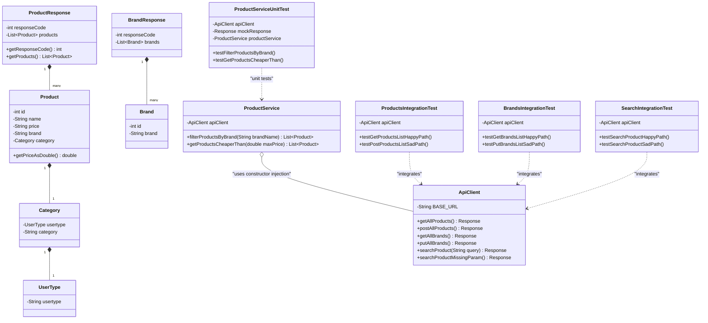

# 🚀 API Testing Mini Project - Test Automation Framework

A professional Java-based API Test Automation Framework designed to test and validate endpoints of the Automation Exercise platform: `https://automationexercise.com`.

---

## 🛠️ Tech Stack & Dependencies

*   **Java 21** - Language compiler source/target.
*   **Maven** - Build management and dependency resolver.
*   **REST-Assured (5.5.0)** - Fluent HTTP request and response builder.
*   **JUnit 5 (Jupiter 5.11.3)** - Core test runner and assertions engine.
*   **Jackson Databind (2.20.1)** - JSON parsing, object mapping, and serialization.
*   **Mockito (5.23.0)** - Mocking framework for unit testing business logic.

---

## 🏗️ Architecture & Package Structure

The framework is structured to keep model representations (POJOs), request client services, logic processing, and test executions cleanly separated:

```text
api_testing_project
 ├── PROJECT_BOARD.md                 # Scrum Scrum Board representation
 ├── pom.xml                          # Project build and dependencies configuration
 └── src/test/java
      └── com.sparta.api_testing_project
           ├── client
           │    └── ApiClient.java    # Handles RestAssured requests
           ├── pojos                  # Object models mapping response JSON structures
           │    ├── Brand.java
           │    ├── BrandResponse.java
           │    ├── Category.java
           │    ├── Product.java
           │    ├── ProductResponse.java
           │    └── UserType.java
           ├── service
           │    └── ProductService.java # Business logic service utilizing ApiClient
           ├── unit                   # Mockito unit tests for service class
           │    └── ProductServiceUnitTest.java
           └── integration            # RestAssured integration tests
                ├── BrandsIntegrationTest.java
                ├── ProductsIntegrationTest.java
                └── SearchIntegrationTest.java
```

---

## 📊 Class Diagram



---

## ⚙️ How to Build and Run the Tests

### Prerequisite
Ensure you have **JDK 21** installed and configured.

### Execute the Test Suite
From the root of the project, run the following Maven command:
```bash
mvn clean test
```

This will automatically:
1. Clean target directories.
2. Fetch and resolve dependencies.
3. Compile all source and test classes.
4. Execute both **Unit Tests** (using Mockito for offline processing logic) and **Integration Tests** (using RestAssured to hit live API endpoints).

---

## 🤝 Collaboration & Project Hand-over Instructions

If a new team is taking over this project, please follow these guidelines to maintain standard code quality and consistency:

1.  **Branching Strategy**:
    *   Do **NOT** commit directly to the `main` branch.
    *   Create feature branches named `feature/description` or `bugfix/issue` from the `dev` branch.
    *   Merge into `dev` via Pull Requests, and ensure all unit/integration tests pass.
2.  **POJO Integrity**:
    *   Any endpoint changes should be reflected in the `pojos` package classes. Use `@JsonProperty` annotations to map JSON keys cleanly.
3.  **Client Separation**:
    *   Keep HTTP setup, base URLs, headers, and endpoints within `ApiClient.java`. Other services or tests must only invoke client methods.
4.  **Mocking Logic**:
    *   When adding helpers or service classes that interact with the network, always write unit tests in the `unit` package, mocking the `ApiClient` using Mockito to guarantee fast offline test execution.
